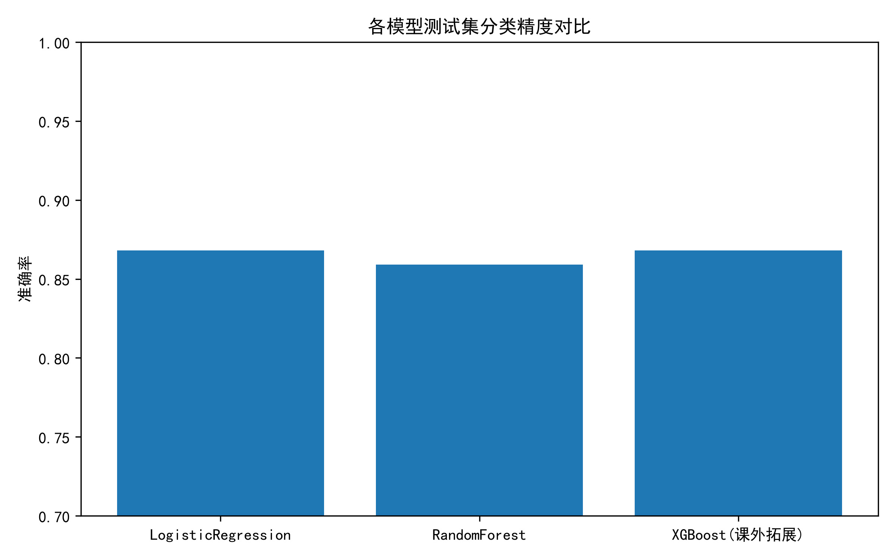
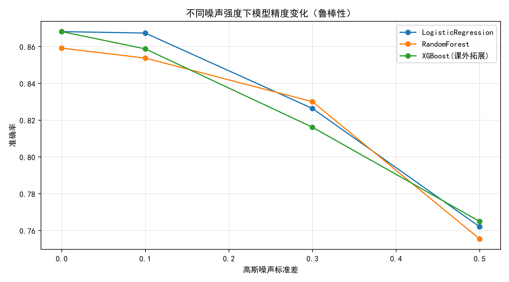
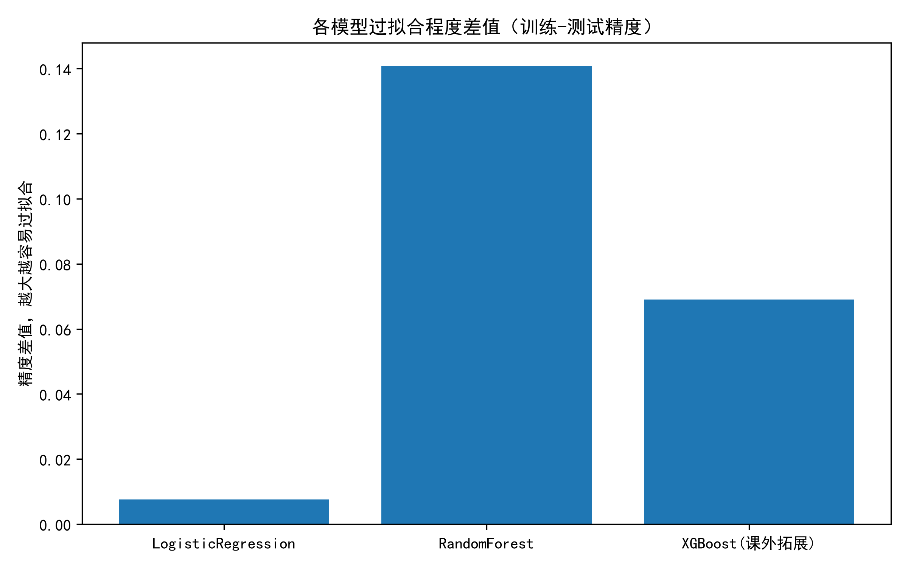
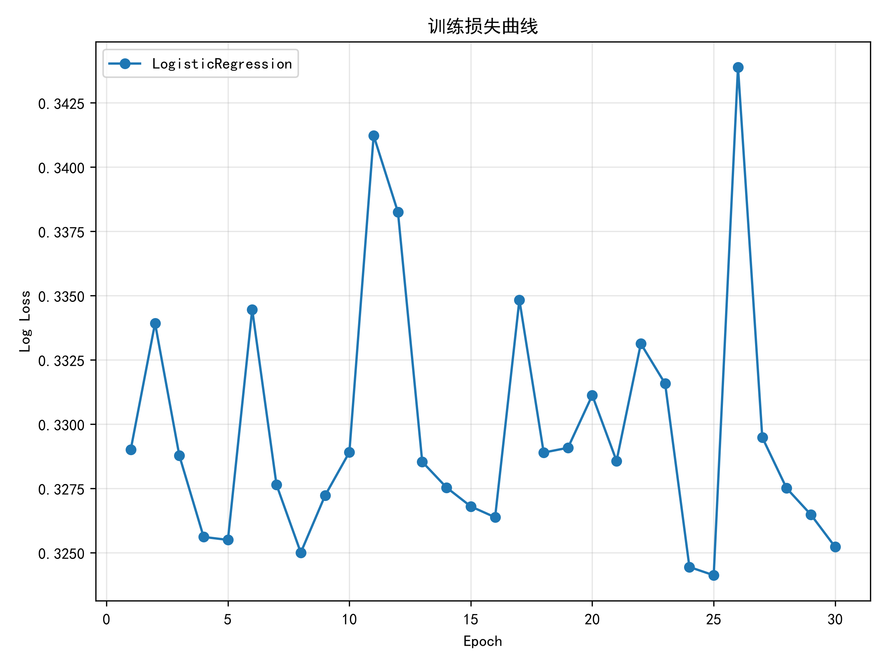

# Dry Bean Dataset 干豆多分类机器学习期末论文

## 1. 摘要

本项目基于 `Dry Bean Dataset Dirty` 脏数据集，完成了数据分析、数据清洗与特征工程、三种多分类模型实验对比、系统集成与课程总结。实验实现了 Logistic Regression、Random Forest 与 XGBoost 三种算法，其中 XGBoost 为课外拓展算法。项目结果表明，Logistic Regression 和 XGBoost 在测试集上表现较好，Random Forest 存在明显过拟合风险，但同样具有较强鲁棒性。

## 2. 数据集介绍

- 数据集名称：Dry Bean Dataset Dirty
- 数据源：项目自带训练集、验证集和测试集
- 样本数量：训练集 9527 个，验证集 1347 个，测试集 2737 个
- 特征数：16 个数值特征 + 1 个类别标签 `Class`
- 主要挑战：
  - 数值特征中含 `?` 缺失值
  - 数值列存在单位后缀（如 `0.9293 cm`）
  - 标签类别存在噪声和不规范写法（如 `DERMASON`, `dermason`, `D3RMAS0N`）
  - 数据中含重复样本

## 3. 数据分析

### 3.1 数据分布与污染

- 类别分布不均衡，`DERMASON`、`SIRA`、`SEKER` 等类别样本较多；`BOMBAY`、`barbunya` 等类别样本较少。
- 脏数据统计：`Perimeter` 存在 677 个缺失值，`Solidity` 存在 658 个缺失值。
- 重复样本数量：49 个。

### 3.2 EDA 结果

已生成的可视化图表：

- `output/eda/label_dist.png`：类别分布柱状图
- `output/eda/corr_heat.png`：特征相关性热力图
- `output/eda/outlier_box.png`：部分特征箱线图，用于观察异常值分布

### 3.3 数据质量问题结论

- 存在缺失值与异常值，需进行清洗
- 部分数值列存在字符串单位，需规范化
- 类别标签写法不统一，需归一化

## 4. 数据处理方案

### 4.1 清洗策略

1. 删除重复样本
2. 将 `?` 识别为缺失值
3. 对所有数值列进行字符串清洗：去除尾部非数字字符（如单位 `cm`）
4. 数值缺失使用中位数填充
5. `Class` 标签缺失使用最多数类别填充
6. 对标签进行统一规范：去空格、统一大写、将 `0` 替换为 `O`、`3` 替换为 `E`
7. 采用 3σ 原则剔除极端异常值

### 4.2 特征工程

1. 低方差特征过滤：`VarianceThreshold(threshold=0.01)`
2. 标准化：`StandardScaler()`
3. PCA 降维：保留 95% 信息，减少特征维度，有助于提高训练效率和稳定性

### 4.3 处理结果

预处理后数据可用于模型训练，避免了原始脏数据中的字符串、缺失值和标签噪声问题。

## 5. 算法实现与实验设计

### 5.1 模型列表

- `LogisticRegression`：课堂基础模型
- `RandomForestClassifier`：课堂基础模型
- `XGBClassifier`：课外拓展模型（满足至少一种未讲授算法要求）

### 5.2 实验流程

- 统一入口：`src/run.py`
- 训练集：训练模型
- 验证集：调参与验证
- 测试集：最终评估
- 评估指标：准确率、过拟合差值、单样本推理时间、噪声鲁棒性

### 5.3 噪声鲁棒性测试

- 使用测试集特征添加高斯噪声
- 噪声标准差：`0.1`, `0.3`, `0.5`
- 评估噪声下精度下降幅度，考察模型稳定性

### 5.4 过拟合分析

- 计算训练集精度与测试集精度差值
- 差值越大表示模型越容易过拟合

## 6. 实验结果

### 6.1 模型对比表

| 模型名称 | 训练集精度 | 验证集精度 | 测试集精度 | 过拟合差值 | 单样本推理(ms) | 噪声0.1精度 | 噪声0.3精度 | 噪声0.5精度 |
|---------|----------|----------|----------|-----------|----------------|-----------|-----------|-----------|
| LogisticRegression | 0.8758 | 0.8724 | 0.8714 | 0.0044 | 0.000225 | 0.8685 | 0.8353 | 0.7755 |
| RandomForest | 1.0000 | 0.8608 | 0.8591 | 0.1409 | 0.017176 | 0.8533 | 0.8214 | 0.7612 |
| XGBoost(课外拓展) | 0.9371 | 0.8600 | 0.8681 | 0.0690 | 0.002949 | 0.8628 | 0.8279 | 0.7513 |

### 6.2 结果分析

- `LogisticRegression`：训练/测试误差差值最小，泛化能力最好，测试集准确率最高，推理速度最快。
- `RandomForest`：训练集达到 100% 精度，但测试集精度下降，过拟合显著；噪声鲁棒性表现一般，推理速度最慢。
- `XGBoost`：作为课外拓展模型，表现平衡，测试精度接近 Logistic Regression，推理速度适中，过拟合程度小于 RandomForest。

### 6.3 鲁棒性对比

- 所有模型在噪声增大时均出现精度下降。
- Logistic Regression 对高斯噪声的稳定性最好，XGBoost 紧随其后，RandomForest 波动略大。

### 6.4 绘图结果

以下图表已直接嵌入本报告：



*测试集精度对比柱状图*



*噪声鲁棒性对比折线图*



*过拟合差值对比柱状图*



*训练损失曲线（可训练模型）*

## 7. 系统集成与项目结构

### 7.1 代码结构

- `src/data_loader.py`：数据读取、EDA 分析、可视化
- `src/preprocess.py`：脏数据清洗、标签规范化、特征工程
- `src/models.py`：模型构建与训练
- `src/train_eval.py`：模型评估、对比、可视化输出
- `src/run.py`：统一执行入口，一键运行全流程

### 7.2 运行方式

1. 安装依赖：
   ```bash
   pip install -r requirements.txt
   ```
2. 执行全流程：
   ```bash
   python src/run.py
   ```
3. 输出文件：
   - `output/model_compare.csv`
   - `output/acc_compare.png`
   - `output/noise_robust.png`
   - `output/overfit_gap.png`
   - `output/eda/*.png`

### 7.3 工程特点

- 命令行统一入口，符合项目要求
- 无 UI 依赖，实验阶段只输出文件
- 项目可扩展性强，方便后续添加更多算法或可视化

## 8. 课程总结与建议

### 8.1 学习收获

- 掌握了完整机器学习工程流程：数据分析、清洗、特征工程、模型训练、评估与对比
- 理解了脏数据处理的重要性，尤其是缺失值、重复样本、单位后缀与标签噪声
- 深化了对多分类算法的理解，学会用准确率、过拟合差值和鲁棒性评估模型
- 通过 XGBoost 拓展了课堂外梯度提升树算法的应用能力

### 8.2 对课程的建议

- 希望进一步讲解模型训练曲线与 loss 监控方法
- 期末作业可增加更多噪声类型对比，例如缺失值插补后再测试鲁棒性
- 课堂实验中可增加对可解释性分析的介绍，如特征重要性、SHAP 值等

## 9. GitHub 展示与链接

项目已上传至 GitHub 仓库：

- GitHub 仓库链接：`https://github.com/QIUXU9178/-`

仓库中包含以下关键文件与目录：
- `README.md`
- `requirements.txt`
- `src/` 代码目录
- `data/` 数据说明（若允许上传，可附示例数据结构）
- `output/` 结果文件与图表
- `论文.md` 与 `论文.docx`

`output/` 目录中包含的主要结果图片：
- `output/acc_compare.png`
- `output/noise_robust.png`
- `output/overfit_gap.png`
- `output/eda/label_dist.png`
- `output/eda/corr_heat.png`
- `output/eda/outlier_box.png`

该仓库展示了完整项目工程结构、运行说明、实验结果与可视化图表，方便教师在线查看和评分。

## 10. 结论

本项目实现了对脏数据集的完整机器学习工程流程，输出了有效的结果对比与可视化图表。最终推荐使用 `LogisticRegression` 作为本任务的首选模型，因其测试精度最高且过拟合风险最低；`XGBoost` 作为次选模型，在鲁棒性与泛化能力上也表现良好。